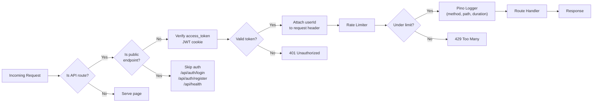

# Architecture

## High-Level System Design

```mermaid
flowchart TD
    subgraph Client["Client Layer"]
        A1["Next.js Pages (React)"]
        A2["React Server Components"]
        A3["Client Components"]
    end

    subgraph Edge["Edge / Middleware"]
        B1["Auth Guard (JWT check)"]
        B2["Rate Limiter"]
        B3["Request Logger (Pino)"]
    end

    subgraph API["API Route Handlers"]
        C1["Auth Routes<br/>/api/auth/*"]
        C2["Workflow Routes<br/>/api/workflows/*"]
        C3["Run Routes<br/>/api/runs/*"]
        C4["Agent Routes<br/>/api/agents/*"]
        C5["Template Routes<br/>/api/templates/*"]
        C6["Usage Routes<br/>/api/usage/*"]
        C7["Health<br/>/api/health"]
    end

    subgraph Services["Service Layer"]
        D1["AuthService"]
        D2["WorkflowService"]
        D3["ExecutionService"]
        D4["AgentService"]
        D5["TemplateService"]
    end

    subgraph Engine["Execution Engine"]
        E1["Context Manager<br/>(variables, state)"]
        E2["Block Runner<br/>(sequential execution)"]
        E3["Variable Propagation<br/>({{var}} resolution)"]
        E4["Output Normalizer<br/>(markdown→JSON parsing)"]
    end

    subgraph Blocks["Workflow Blocks"]
        F1["Trigger<br/>- Event source<br/>- Schedule<br/>- Payload init"]
        F2["AI Action<br/>- Provider dispatch<br/>- Prompt templating<br/>- Token tracking"]
        F3["Condition<br/>- Expression eval<br/>- Variable lookup<br/>- Branch routing"]
        F4["Email<br/>- SMTP integration<br/>- Template render"]
        F5["Notification<br/>- In-app toast<br/>- Webhook push"]
        F6["Delay<br/>- Timer wait<br/>- Async resume"]
    end

    subgraph AI["AI Provider Layer"]
        G1["Gemini Provider<br/>(active)"]
        G2["OpenAI Provider<br/>(extensible)"]
        G3["Anthropic Provider<br/>(future)"]
        G4["Model Registry<br/>models.ts"]
    end

    subgraph DB["Data Layer"]
        H1["Prisma ORM"]
        H2["PostgreSQL"]
    end

    Client --> Edge
    Edge --> API
    API --> Services
    Services --> Engine
    Engine --> Blocks
    Blocks --> AI
    AI --> DB
    Services --> DB
    Blocks --> DB
```



---

## Frontend Architecture

### Page Structure (Next.js 15 App Router)

```
src/app/
├── layout.tsx            # Root layout (Toaster, providers)
├── globals.css            # Tailwind + global styles
├── page.tsx               # Landing page (public)
├── login/                 # Login page (public)
├── register/              # Register page (public)
└── (dashboard)/           # Protected routes (auth guard)
    ├── layout.tsx         # Dashboard layout (sidebar, header)
    ├── page.tsx           # Dashboard home (stats, recent runs)
    ├── workflows/
    │   ├── page.tsx       # Workflow list
    │   └── [id]/
    │       └── page.tsx   # Workflow builder canvas
    ├── runs/
    │   └── page.tsx       # Run history
    ├── analytics/
    │   └── page.tsx       # Usage & cost analytics
    └── agents/
        └── page.tsx       # Agent management
```

### Component Tree

```
RootLayout
├── <Toaster />                     # Sonner notifications
├── LandingPage (public)            # /
├── LoginPage (public)              # /login
├── RegisterPage (public)           # /register
└── DashboardLayout (protected)     # /(dashboard)
    ├── Sidebar                     # Navigation + branding
    ├── Header                      # User menu + search
    ├── DashboardPage               # /
    │   ├── StatsCards
    │   ├── ActivityFeed
    │   └── RecentWorkflows
    ├── WorkflowListPage            # /workflows
    │   └── WorkflowCard[]
    ├── WorkflowBuilderPage         # /workflows/[id]
    │   ├── BuilderCanvas           # Drag-and-drop area
    │   ├── BuilderSidebar          # Block palette
    │   └── BuilderProperties       # Block config panel
    ├── RunHistoryPage              # /runs
    │   └── RunCard[]
    ├── AnalyticsPage               # /analytics
    │   ├── UsageChart
    │   ├── CostChart
    │   └── SuccessRateCard
    └── AgentsPage                  # /agents
        └── AgentCard[]
```

---

## Backend Architecture

### Route Handlers

Every API route follows the same layered pattern:

```
Route Handler (Next.js)
  → Zod validation (parse request body/params)
  → Auth check (getUserId or getAuthUser)
  → Ownership check (verify user owns resource)
  → Service method (business logic)
    → Repository / ORM (data access)
  → Response serialization (structured JSON)
  → Error handling (centralized catch block)
```

### API Endpoints

| Method | Path | Auth | Description |
|--------|------|------|-------------|
| POST | `/api/auth/register` | No | Register new user |
| POST | `/api/auth/login` | No | Login, return tokens |
| POST | `/api/auth/logout` | Yes | Clear sessions |
| GET | `/api/auth/me` | Yes | Current user profile |
| POST | `/api/auth/refresh` | No* | Refresh access token |
| GET | `/api/workflows` | Yes | List user workflows |
| POST | `/api/workflows` | Yes | Create workflow |
| GET | `/api/workflows/[id]` | Yes | Get workflow detail |
| PATCH | `/api/workflows/[id]` | Yes | Update workflow |
| DELETE | `/api/workflows/[id]` | Yes | Delete workflow |
| POST | `/api/workflows/[id]/run` | Yes | Execute workflow |
| GET | `/api/workflows/[id]/runs` | Yes | List workflow runs |
| GET | `/api/runs` | Yes | List all user runs |
| GET | `/api/runs/[id]` | Yes | Run detail + usage |
| GET | `/api/agents` | Yes | List user agents |
| POST | `/api/agents` | Yes | Create agent |
| PATCH | `/api/agents/[id]` | Yes | Update agent |
| DELETE | `/api/agents/[id]` | Yes | Delete agent |
| POST | `/api/agents/[id]/deploy` | Yes | Deploy agent |
| GET | `/api/templates` | Yes | List templates |
| POST | `/api/templates` | Yes | Create template |
| POST | `/api/templates/[id]/use` | Yes | Create workflow from template |
| GET | `/api/usage` | Yes | Usage + cost analytics |
| GET | `/api/health` | No | Health check |

---

## Execution Engine Flow

The execution engine (`src/lib/execution/engine.ts`) orchestrates sequential workflow execution:

```
executeWorkflow(steps, context)
│
├─ Initialize context.vars = {}
│
├─ For each step (in order):
│   ├─ Resolve variable references in config ({{block_X.field}})
│   │   └─ Uses regex {{([^}]+)}} to find all references
│   │       then splits on "." to traverse context.vars
│   ├─ Get executor for block type (getExecutor())
│   ├─ Execute block: executor.execute(config, context)
│   ├─ Store output: context.vars[block.id] = result.output
│   │
│   ├─ If block type is "trigger":
│   │   └─ Also set context.vars.trigger = result.output
│   │
│   ├─ If block type is "ai-action":
│   │   ├─ Store raw: context.vars.lastAiResponse = result.output
│   │   ├─ Normalize: normalizeAiOutput(result.output)
│   │   │   └─ Strip ```json fences, JSON.parse
│   │   └─ Merge parsed fields into context.vars
│   │
│   ├─ If block type is "condition":
│   │   ├─ Evaluate expression against context.vars
│   │   ├─ Returns { matched: true/false, path: "..." }
│   │   └─ (Future: branch routing based on path)
│   │
│   └─ Log metrics: { blockId, type, executionTime, status }
│
└─ Return final context.vars and aggregated metrics
```

### Block Executors

Each block type has a dedicated executor in `src/lib/execution/blocks/`:

| Block | File | Key Behavior |
|-------|------|-------------|
| Trigger | `trigger.ts` | Resolves source (event/schedule/webhook), initializes payload with mock ticket data |
| AI Action | `ai-action.ts` | Resolves model → provider via `models.ts`, builds prompt with `{{var}}` resolution, calls AI service, tracks token cost |
| Condition | `condition.ts` | Resolves variable paths from `context.vars`, evaluates operator-based expressions, returns match result |
| Email | `email.ts` | (Stub) Formats email payload with recipient, subject, body |
| Notification | `notification.ts` | (Stub) Creates notification payload for in-app display |
| Delay | `delay.ts` | (Stub) Returns wait duration for scheduled execution |

---

## AI Provider Abstraction

The AI layer (`src/lib/ai/`) provides a clean abstraction for multi-provider support:

### Architecture

```
AIService (service.ts)
  ├── getProvider(providerName) → AIProvider
  ├── generateText(config) → AIResponse
  └── (future) streamText, countTokens, etc.

AIProvider (interface)
  ├── generateText(config) → Promise<AIResponse>
  └── (future) streamText, countTokens

GeminiProvider (providers/gemini.ts)
  └── implements AIProvider

OpenAIProvider (providers/openai.ts) — interface ready, not wired
AnthropicProvider — future
```

### Model Registry (`models.ts`)

Central registry mapping all models to providers:

```typescript
MODEL_REGISTRY = {
  "gpt-4o":          { provider: "openai",    supported: true  },
  "gpt-4o-mini":     { provider: "openai",    supported: true  },
  "claude-3.5-sonnet": { provider: "anthropic", supported: true },
  "gemini-2.5-flash": { provider: "gemini",   supported: true  },
  "gemini-2.5-pro":  { provider: "gemini",   supported: true  },
  "gemini-pro":      { provider: "gemini",   supported: false,
                       replacement: "gemini-2.5-flash" },
  // ... deprecated models mapped to replacements
}
```

Key functions:
- `resolveModel(rawModel)` — Returns supported model name (maps deprecated → current)
- `resolveProvider(rawModel)` — Returns provider string for any model
- `getModelPricing(model)` — Returns token cost for input/output
- `getSupportedModels()` — Returns only active models

---

## Database Schema

### Entity Relationships

```
User ──┬── Workflow ──┬── WorkflowRun ──┬── UsageLog
       │              │                  │
       │              └── WorkflowTemplate (createdBy)
       │
       ├── Agent
       ├── Session (refresh tokens)
       ├── APIKey
       ├── Subscription
       ├── UsageLog
       └── TeamMember ─── Team ──┬── Workflow
                                 ├── Agent
                                 ├── Subscription
                                 └── UsageLog
```

### Index Strategy

- **User**: email (unique), isActive + createdAt
- **Workflow**: userId + status + updatedAt, teamId + status, status + lastRunAt
- **WorkflowRun**: workflowId + status + startedAt, userId
- **Agent**: userId + status, teamId + status
- **Session**: userId, refreshToken (unique)
- **UsageLog**: userId + usageType + recordedAt, usageType + recordedAt
- **WorkflowTemplate**: category + usageCount, isBuiltIn + usageCount
- **APIKey**: userId + isActive, keyHash (unique)
- **TeamMember**: userId + teamId (unique), teamId + role

See `prisma/schema.prisma` for the full schema definition (11 models, 8 enums, 18 indexes).

---

## Middleware Lifecycle

The edge middleware (`src/middleware.ts`) runs on every request and handles:



### Middleware Stack (applied in order):

1. **Auth Guard** — Reads `access_token` cookie, verifies JWT, sets `x-user-id` header. Skips auth for public routes (`/api/auth/login`, `/api/auth/register`, `/api/health`).

2. **Rate Limiter** — Token bucket per IP using in-memory Map. 100 requests/minute default (configurable via `RATE_LIMIT_MAX`). Returns `429` with `Retry-After` header when exceeded.

3. **Request Logger** — Logs `method`, `path`, `status`, `duration` via Pino for every request (except static assets).
